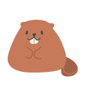
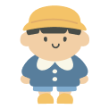
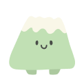
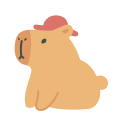

<!-- Rodent Emojis -->

  🐹 🐿️ 🐭 🐹 🐿️

<!-- ─────────────  HEADER  ───────────── -->

  <!-- 🍇🟢 Purple & Green Banner PNG -->
  

<!-- 🔽🔽🔽 Large Name Asset Header 🔽🔽🔽 -->

  

<!-- 5 Character PNGs Section -->

      
        
      
  

---

### 🐿️ A Little About Me

  I craft playful, interactive experiences at the intersection of visual design, illustration, and code.  
  🎓 Visual Designer · Based in Korea 
  💡 Current Focus: Dynamic artwork with SVG + procedural generation

---

### 🌰 My Acorn Stash (Tools)

  
  
  
  
   
  
  
  
  

---

## 🚧 Working in my Secret Den...
> I'm busy building brand-new projects behind the scenes...  
> Stay tuned for the big reveal..

---

### 🪵 Skill Growth (Languages)

  

  <table style="margin: 0 auto; border-collapse: collapse; border: none;">
    <tr>
      <td align="left" style="border: none; padding: 10px;">
        
        
        
        
      </td>
    </tr>
  </table>
  
  <svg width="400" height="20" xmlns="http://www.w3.org/2000/svg">
    <rect width="400" height="20" fill="#eee" rx="10" />
    <rect width="178.4" height="20" fill="#0175C2" rx="10" /> <rect x="178.4" width="82" height="20" fill="#E34F26" /> <rect x="260.4" width="73.6" height="20" fill="#F7DF1E" /> <rect x="334" width="66" height="20" fill="#1572B6" rx="10" /> </svg>

---

## 📬 Let's Connect
- ✉️ <a href="mailto:nyeworkshin@gmail.com">nyeworkshin@gmail.com</a>
- 📸 Instagram → <a href="https://instagram.com/nyeworkshin">@nyeworkshin</a>

<!-- Rodent Emojis -->

  🐹 🐿️ 🐭 🐹 🐿️

